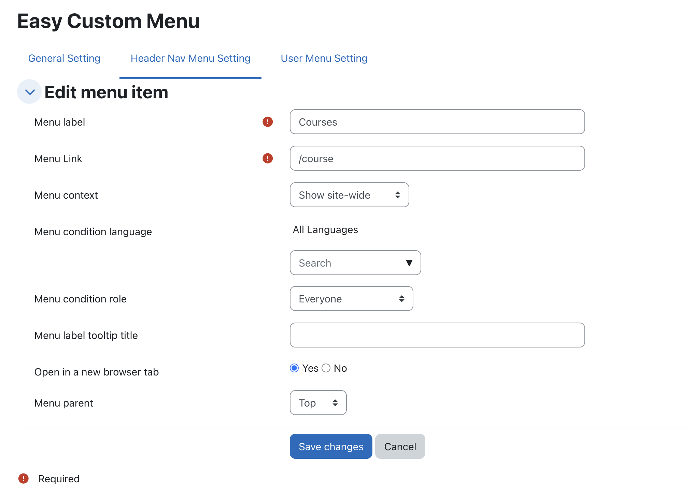
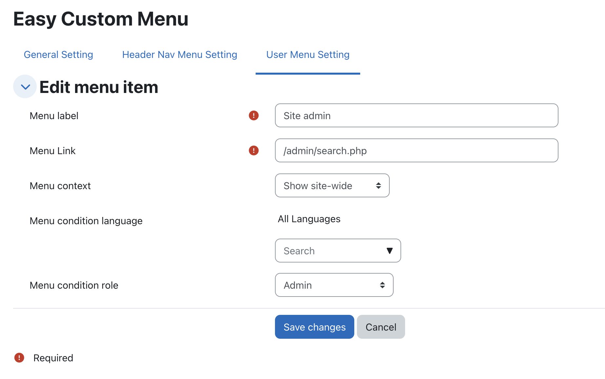

## Easy Custom Menu Plugin 
1. The **Easy Custom Menu** plugin improves the user experience by providing flexible control over custom nav and user menus.  
2. Help to hide the default primary menus:
   - Home  
   - Dashboard  
   - My courses  
   - Site administration  
3. Manage custom menus with flexible conditions.
4. Conditions can be applied based on:
   - **Role** – Display menus according to user roles.  
   - **Context** – Show menus site-wide or within specific courses (including activities such as modules or pages).  
   - **Language** – Display menus depending on the user’s language preference.  
5. Option to open menu items in a **new browser tab**.

## Installation
You can download as a zip from github then extract into your_moodle/local/easycustmenu/

## Screenshot

