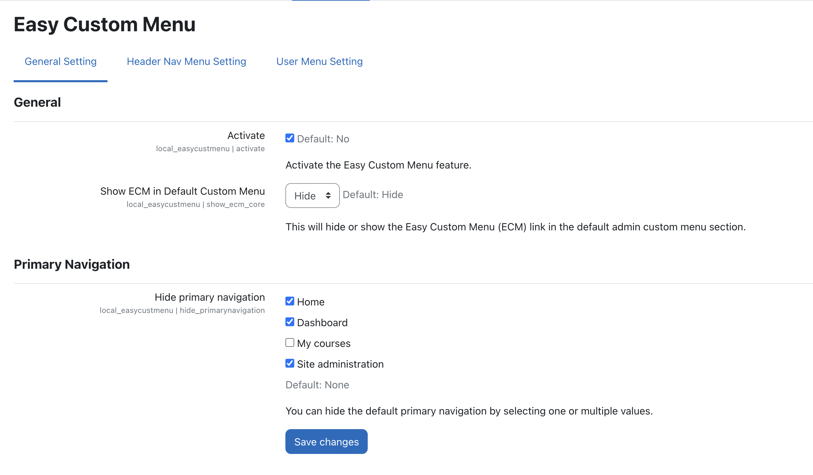

## Easy Custom Menu Plugin 
1. Easy Custom Menu Plugin help to improve the user experience to manage the custom and user menu. 
2. It help to hide the default primary menu which are: Home, Dashboard, My courses, Site administration.
3. Manage the site custom menu with condition.
4. Condition can be applied as: 
    Role base condition.
    Context base condition as site or course, course also include activities i.e mod pages.
    Language base condition.
5. Open in a new browser tab.

## Installation
You can download as a zip from github then extract into your_moodle/local/easycustmenu/

## Screenshot

